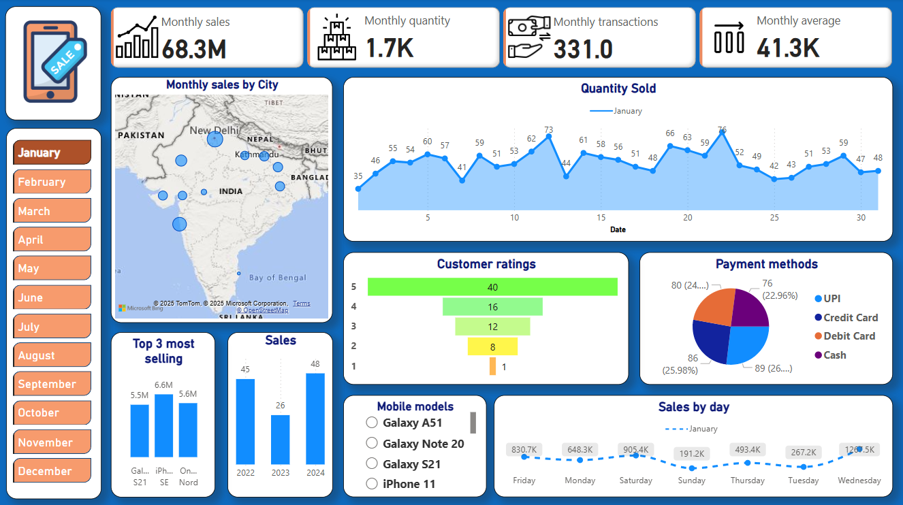

# 📊 Mobile Sales Dashboard (Power BI Project)

This repository contains a Power BI dashboard created as the **final project** for the **Power BI course** provided by **Skill Course**. The dashboard visualizes mobile sales data across Indian cities from **2021 to 2024**.

---

## 🔍 Project Overview

The raw dataset was initially **dirty and unstructured**, so I used **Power Query** to clean and transform it. The data showcases mobile phone sales, quantities, ratings, and transaction patterns across different models and time frames.

This dashboard was developed to present these insights in an interactive and accessible format using **Power BI Desktop**.

---

## 📅 Dataset Timeline

- Covers sales data from **2021 to 2024**
- Dashboard view currently filtered for **January 2024**

---

## 📌 Key Features

- 📍 **Map View** of monthly sales by city  
- 📊 **Time-series graph** for daily quantity sold  
- 🌟 **Customer Ratings** breakdown  
- 🧾 **Payment Methods** used across transactions  
- 📅 **Sales by Day of the Week**  
- 🏆 **Top 3 Selling Models**  
- 📈 **Year-over-Year Sales Comparison**

---

## 🧹 Data Cleaning Highlights

Performed using **Power Query**:
- Removed null/duplicate rows
- Standardized date and category formats
- Cleaned mobile model names and payment entries

---

## 🛠️ Tools Used

- Power BI Desktop
- Power Query Editor
- DAX (Data Analysis Expressions)

---

## 📁 Repository Contents

- `dashboard.png` – Screenshot of the final dashboard  
- `mobile_sales_DB.pbix` – Power BI report file  
- `Day - 30 - Mobile Sales Data.xlsx` – Original dataset  
- Supporting assets/images used in dashboard visuals  

---

## 📚 Course Info

> This project was completed as part of the **Power BI course** by **Skill Course**, under the "Final Dashboard Project" module.

---

## 🔗 License

This project is released under the [MIT License](LICENSE).

---

## 🙌 Acknowledgements

Special thanks to the **Skill Course** team for providing hands-on learning through this project.
